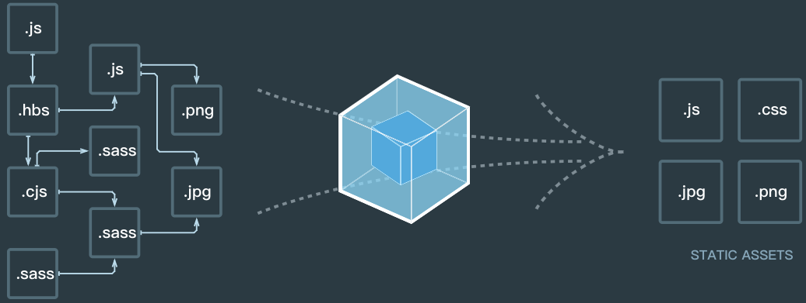

# Webpack基本功能理解以及使用

对于前端工程化，webpack一个神奇的工具，既然是个神奇的工具。那我们保留我们的好奇心，来聊一聊它，首先我们要搞清楚webpack到底是用来**解决什么问题的**，然后我们来看看它到底是**怎么做的**，最后来看看它的**一些基本用法**，下面就来侃一侃。

##  什么是webpack以及webpack的作用 （解决什么问题）
* 如今web前端的业务功能越来越复杂，实现方式也越来越丰富，在web页面开发过程中我们通常会引用很多第三方模块以及一些拓展语言（stylus，Scss， JSX...）来简化开发难度，而这些第三方模块和一些拓展语言浏览器不能直接识别，所以要通过经过打包过程生成可以让浏览器识别的格式。   
就像一幢居民楼，要建起这样一座居民楼，最基本的材料是砖、瓦、钢筋、混凝土。而要组合这些材料形成一幢建筑，肯定是有一定的方法流程以及工具的，比如第一步先搭建地基，后面用塔吊不断的在地基上叠加完善就形成了一幢建筑。在这个过程中，用到的方法流程以及工具起到的作用就类似于webpack。
* 进入正题，webpack其实就是一个JavaScript模块集成工具，同时具有压缩文件以及优化文件结构的作用。经过webpack打包生成的bundle包，可被浏览器识别解析。
在这个过程中，会用到一些loaders解析工具用来预处理一些模块以及拓展语言（例如：stylus、Scss...）,这些工具的配置使用都是在webpack中完成的。其中常用的loaders工具有：style-loader、 css-loader、 stylus-loader。

> 基本概念

##  webpack实现原理  （怎么做的）

原理的理解可以参照上图。
webpack的最核心的原理： **1、一切皆模块  2、按需加载。**

* *一切皆模块*  webpack会将源程序按照程序结构分割成一个个独立的小模块，当需要这些小模块时，进行组合重构，避免冗余，达到重复利用。

* *按需加载* 传统的打包工具是将所有模块编译生成一个庞大的bundle.js文件，这样形成的打包文件体积过于庞大，而webpack通过异步加载可以实现按需加载，减小了打包后的体积。

## webpack的使用方法 （怎么用它）

在使用webpack之前首先要理解四个基本概念：   

### 1. 入口(entry)
### 2. 输出(output)
### 3. loader
### 4. 插件(plugins)

> 入口

## 参考： [webpack中文文档](https://www.webpackjs.com/concepts/)

本文基于自己学习网络中的webpack整理的一份基本概念文档，是自己对于webpack使用的理解总结，如有问题，烦请评论指正，共同学习，共同进步。😁😁😁😁
